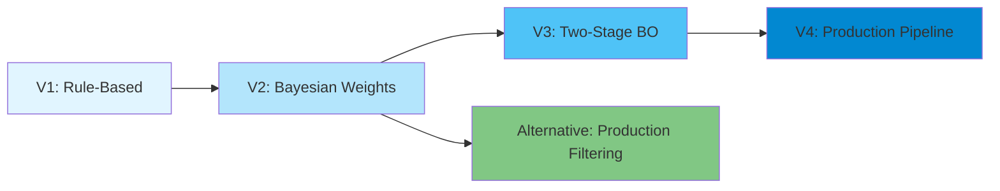

# VM Recommendation System

A comprehensive research project exploring intelligent virtual machine recommendation systems for AWS EC2 instances. This repository documents the evolution from basic rule-based systems to advanced Bayesian optimization approaches, culminating in a production-ready AWS pipeline with live workload profiling.

## 🎯 Overview

This project implements multiple VM recommendation systems that intelligently match workload requirements to optimal AWS EC2 instances. The systems balance performance, cost efficiency, and resource fit using various optimization techniques including Bayesian optimization, workload-aware scoring, and multi-objective ranking.

### Key Capabilities

- **Workload-Aware Recommendations**: Adapts to CPU-intensive, memory-intensive, network-intensive, and balanced workloads
- **Cost-Performance Optimization**: Balances resource fit with cost efficiency
- **Live Profiling**: Automated workload profiling on EC2 with CloudWatch metrics
- **Bayesian Optimization**: Learns optimal scoring weights for different workload types
- **Production Pipeline**: Fully automated AWS Step Functions orchestration
- **Comprehensive Evaluation**: Baseline comparisons, ablation studies, and statistical validation

## 📁 Repository Structure

```
VM-Recommendation-System/
├── README.md                           # This file - project overview
├── workload.py                         # FastAPI workload profiling endpoints
│
├── AWS/
│   ├── First system/                   # V1: Rule-based recommender
│   │   ├── README.md                   # Detailed documentation (358 lines)
│   │   ├── run.py                      # Main entry point
│   │   ├── recommender.py              # Core recommendation logic
│   │   ├── scorer.py                   # Scoring functions
│   │   ├── performance_model.py        # Performance modeling
│   │   └── energy_model.py             # Energy efficiency modeling
│   │
│   ├── Bayesian/                       # V2: Bayesian optimization system
│   │   ├── README.md                   # Detailed documentation (435 lines)
│   │   ├── main.py                     # Pipeline orchestration
│   │   ├── preprocessing/              # Feature engineering & filtering
│   │   ├── scoring/                    # VM scoring logic
│   │   ├── optimization/               # Bayesian weight optimizer
│   │   └── config/                     # Workload constraints
│   │
│   ├── two-stage recommender/          # V3: Advanced two-stage system
│   │   ├── README.md                   # Detailed documentation (428 lines)
│   │   ├── main.py                     # Original pipeline
│   │   ├── main_v2.py                  # Workload-aware pipeline
│   │   ├── lambda_handler.py           # AWS Lambda integration
│   │   ├── preprocessing/              # Hard filtering & feature engineering
│   │   ├── scoring/                    # Fit scoring & final ranking
│   │   ├── optimization/               # Bayesian ranker & workload-aware BO
│   │   ├── postprocessing/             # Family diversification
│   │   ├── baselines/                  # Comparison methods
│   │   ├── evaluation/                 # Metrics (RSE, diversity, etc.)
│   │   └── experiments/                # Ablation studies & sensitivity analysis
│   │
│   └── vm-recommendation-system/       # Alternative implementation
│       ├── README.md                   # Detailed documentation (505 lines)
│       ├── main.py                     # Entry point
│       ├── preprocessing/              # Data loading & filtering
│       ├── scoring/                    # Normalization & scoring
│       └── recommender/                # Recommendation logic
│
└── vm-recommender-pipeline/            # V4: Production AWS pipeline
    ├── readme.md                       # Detailed pipeline documentation
    ├── index.html                      # Web UI frontend
    ├── state_machine.json              # Step Functions definition
    ├── start_pipeline/                 # API Gateway entry point
    ├── launch_profiling_ec2/           # EC2 launcher with Docker
    ├── collect_metrics/                # CloudWatch metrics collector
    ├── infer_requirements/             # Metrics → requirements converter
    ├── recommend_vm/                   # Two-stage recommender (Lambda)
    ├── terminate_ec2/                  # Cleanup Lambda
    └── get_pipeline_result/            # Status polling endpoint
```

## 🚀 Systems Overview

### 1. First System (Rule-Based) - `AWS/First system/`

**Approach**: Basic filtering and heuristic scoring

- Hard constraint filtering (vCPU, memory, network, price)
- Simple weighted scoring: `score = w₁·compute + w₂·memory + w₃·network - w₄·cost`
- Fixed weights based on workload type
- Performance and energy modeling

**Use Case**: Baseline comparison, educational reference

📖 **[Detailed Documentation](AWS/First%20system/README.md)** (358 lines)

### 2. Bayesian Optimization System - `AWS/Bayesian/`

**Approach**: Learn optimal scoring weights via Bayesian optimization

- Workload-specific constraint filtering
- Feature engineering (compute scores, cost efficiency)
- Bayesian optimization to learn weights: `{compute, memory, network, cost}`
- Normalized scoring across dimensions

**Key Innovation**: Data-driven weight learning instead of fixed heuristics

**Use Case**: Improved recommendations through learned preferences

📖 **[Detailed Documentation](AWS/Bayesian/README.md)** (435 lines)

### 3. Two-Stage Recommender (Advanced) - `AWS/two-stage recommender/` ⭐

**Approach**: Workload-aware fit scoring with two-stage Bayesian optimization

**Architecture**:
```
Input Requirements
    ↓
Hard Filtering (remove non-viable instances)
    ↓
Feature Engineering (compute scores, ratios)
    ↓
Fit Score Calculation (oversize penalties)
    ↓
Bayesian Optimization (learn penalty weights)
    ↓
Final Scoring (fit + cost + generation)
    ↓
Diversification (ensure family variety)
    ↓
Top-K Recommendations
```

**Key Features**:
- **Two-stage design**: Separates intent derivation from penalty weight learning
- **Workload-aware scoring**: Adapts penalties based on workload characteristics
- **Oversize penalties**: Squared penalties heavily penalize oversized instances
- **Family diversification**: Ensures variety in recommendations
- **Comprehensive evaluation**: Baselines, ablation studies, sensitivity analysis

**Key Innovation**: Solves the "coupled resources problem" where compute and memory are physically linked in cloud instances

**Use Case**: Production-grade recommendations with rigorous evaluation

📖 **[Detailed Documentation](AWS/two-stage%20recommender/README.md)** (428 lines)

### 4. Alternative Implementation - `AWS/vm-recommendation-system/`

**Approach**: Production-oriented with comprehensive filtering

- Region, OS, tenancy, and GPU filtering
- Current generation focus
- Fixed workload-specific weights
- Advanced feature engineering (physical cores, ECU, normalization factors)
- Budget-aware recommendations

**Key Innovation**: Practical filtering for production deployments

**Use Case**: Region-specific, OS-specific, and budget-constrained scenarios

📖 **[Detailed Documentation](AWS/vm-recommendation-system/README.md)** (505 lines)

### 5. Production Pipeline - `vm-recommender-pipeline/` 🏭

**Approach**: End-to-end automated pipeline with live workload profiling

**Architecture**:
```
Web UI (S3 Static Site)
    ↓
API Gateway (POST /recommend)
    ↓
Step Functions State Machine
    ├─ Launch EC2 (t3.large)
    ├─ Run Docker Container
    ├─ Apache Bench Load Testing
    ├─ Collect CloudWatch Metrics
    ├─ Infer Requirements
    ├─ Recommend VMs (Two-Stage System)
    └─ Terminate EC2
    ↓
API Gateway (GET /result)
    ↓
Web UI (Results Display)
```

**Key Features**:
- **Live profiling**: Runs your containerized workload on EC2
- **A/B testing**: Compare multiple endpoints in a single run
- **Automated metrics**: CPU, memory, disk, network via CloudWatch
- **Requirement inference**: Converts observations to VM requirements
- **Integrated recommender**: Uses two-stage system for recommendations
- **Web interface**: User-friendly frontend for job submission

**AWS Services**: S3, API Gateway, Lambda, Step Functions, EC2, CloudWatch, IAM

**Use Case**: Production deployment for automated VM recommendation

📖 **[Detailed Documentation](vm-recommender-pipeline/readme.md)** (208 lines)

### 6. Workload Profiling API - `workload.py`

**Approach**: FastAPI endpoints for synthetic workload benchmarking

**Endpoints**:
- `GET /cpu` - CPU-intensive workload (Fibonacci computation)
- `GET /memory` - Memory-intensive workload (large array operations)
- `GET /network` - Network-intensive workload (data transfer simulation)
- `GET /balanced` - Balanced workload (matrix multiplication + I/O)

**Use Case**: Testing and benchmarking VM performance characteristics

## 🔄 System Evolution



**Evolution Highlights**:

1. **V1 → V2**: Fixed heuristics → Learned weights via Bayesian optimization
2. **V2 → V3**: Single-stage BO → Two-stage design (intent + penalty weights)
3. **V2 → Alternative**: BO weights → Practical filtering for production
4. **V3 → V4**: Standalone system → Integrated AWS pipeline with live profiling

## 📊 Feature Comparison

| Feature | First System | Bayesian | Alternative | Two-Stage | Pipeline |
|---------|-------------|----------|-------------|-----------|----------|
| **Optimization Method** | Fixed weights | BO (outer weights) | Fixed weights | BO (penalty weights) | Two-stage BO |
| **Workload Awareness** | Basic | Constraint-based | Fixed weights | Intent-derived | Profiling-based |
| **Region Filtering** | ❌ | ❌ | ✅ | ❌ | ✅ |
| **OS/Tenancy Filter** | ❌ | ❌ | ✅ | ❌ | ✅ |
| **GPU Support** | ❌ | ❌ | ✅ | ❌ | ✅ |
| **Evaluation Framework** | ❌ | ❌ | ❌ | ✅ Comprehensive | ✅ Integrated |
| **Baseline Comparisons** | ❌ | ❌ | ❌ | ✅ 4 baselines | ✅ Inherited |
| **Family Diversification** | ❌ | ❌ | ❌ | ✅ | ✅ |
| **Live Profiling** | ❌ | ❌ | ❌ | ❌ | ✅ EC2 + CloudWatch |
| **Production Ready** | ❌ | ❌ | ✅ Filtering | ⚠️ Lambda-ready | ✅ Full pipeline |
| **Web Interface** | ❌ | ❌ | ❌ | ❌ | ✅ S3 static site |
| **A/B Testing** | ❌ | ❌ | ❌ | ❌ | ✅ Multi-endpoint |
| **Documentation** | ✅ 358 lines | ✅ 435 lines | ✅ 505 lines | ✅ 428 lines | ✅ 208 lines |

## 🚦 Quick Start

### Prerequisites

```bash
# Python 3.8+
pip install pandas numpy scikit-optimize boto3 fastapi uvicorn
```

### Running the Two-Stage Recommender (Recommended)

```python
from AWS.two_stage_recommender.main_v2 import run_recommendation

requirements = {
    "required_compute": 432000,  # 16 vCPU × 27,000 CoreMark/core
    "memory_gib": 64,
    "network_mbps": 25000,
    "max_price": 5.0
}

recommendations = run_recommendation(requirements)
print(recommendations)
```

### Running the Workload Profiling API

```bash
# Start the FastAPI server
uvicorn workload:app --reload --port 8000

# Test endpoints
curl "http://localhost:8000/cpu?n=35"
curl "http://localhost:8000/memory?size=200000000"
curl "http://localhost:8000/network?size_mb=500"
curl "http://localhost:8000/balanced?n=400"
```

### Deploying the Production Pipeline

See [vm-recommender-pipeline/readme.md](vm-recommender-pipeline/readme.md) for complete AWS deployment instructions including:
- S3 bucket setup
- Lambda function deployment
- Step Functions state machine creation
- API Gateway configuration
- IAM roles and permissions

## 📚 Detailed Documentation

- **Two-Stage Recommender**: [AWS/two-stage recommender/README.md](AWS/two-stage%20recommender/README.md)
  - Algorithm details (intent derivation, BO objective)
  - Evaluation metrics (RSE, diversity, cost efficiency)
  - Experiment results (ablation studies, baseline comparisons)
  - Design rationale (why two stages, why squared penalties)
  
- **Production Pipeline**: [vm-recommender-pipeline/readme.md](vm-recommender-pipeline/readme.md)
  - AWS architecture and services
  - Deployment guide
  - API usage examples
  - Pipeline timeout reference

## 🔬 Key Algorithms

### Intent Weight Derivation (Two-Stage System)

```python
# Stage 1: Derive intent from requirements
utilization_compute = required_compute / pool_median_compute
utilization_memory = required_memory / pool_median_memory
utilization_network = required_network / pool_median_network

intent_weights = normalize([utilization_compute, utilization_memory, utilization_network])
```

### Workload-Aware Fit Score

```python
# Compute oversize ratios
compute_ratio = (vm_compute - required_compute) / required_compute
memory_ratio = (vm_memory - required_memory) / required_memory
network_ratio = (vm_network - required_network) / required_network

# Apply learned penalty weights (α, β, γ from BO)
penalty = α·compute_ratio² + β·memory_ratio² + γ·network_ratio²
fit_score = 1 / (1 + penalty)
```

### Bayesian Optimization Objective

```python
# Stage 2: Learn penalty weights that maximize intent-weighted improvement
objective = -Σ(intent_d × improvement_d)
where improvement_d = (baseline_RSE_d - weighted_RSE_d) / baseline_RSE_d
```

## 📈 Performance Metrics

### Two-Stage Recommender
- **Runtime**: 2-5 seconds for 800-instance pool
- **BO Iterations**: 30 calls (configurable)
- **Memory Usage**: ~50MB
- **Scalability**: Linear with pool size

### Production Pipeline
- **Total Duration**: ~10-12 minutes end-to-end
- **EC2 Launch**: ~2 minutes
- **Profiling Window**: 4 minutes
- **Recommendation**: ~30 seconds

## 🧪 Experiments & Evaluation

The two-stage recommender includes comprehensive evaluation:

- **Baseline Comparisons**: Random, Heuristic, CherryPick-like, Micky-like
- **Ablation Studies**: Component contribution analysis
- **Sensitivity Analysis**: BO parameter tuning
- **Statistical Validation**: Multi-run significance testing
- **Scalability Tests**: Performance under varying pool sizes

Results available in `AWS/two-stage recommender/experiments/*.csv`

## 🛠️ Common Requirements

All systems require an AWS EC2 dataset with the following columns:
- `instanceType`: EC2 instance name (e.g., "m5.xlarge")
- `vcpu`: Number of virtual CPUs
- `memory`: Memory in GiB (string or numeric)
- `networkPerformance`: Network bandwidth description
- `price_per_hr`: On-demand price per hour
- `physicalProcessor`: Processor model
- `coremark_total`: Total CoreMark score (optional but recommended)

Dataset location: `s3://vm-recommendation-data/combined_vms.csv` or `aws_with_coremark.csv`

## 📚 Detailed Documentation

- **First System (Rule-Based)**: [AWS/First system/README.md](AWS/First%20system/README.md) (358 lines)
  - Performance-to-power ratio (PPR) scoring
  - Energy and performance modeling
  - Fixed weight configuration
  - Workload profiles and usage examples

- **Bayesian Optimization System**: [AWS/Bayesian/README.md](AWS/Bayesian/README.md) (435 lines)
  - Bayesian optimization algorithm details
  - Weight learning process
  - Workload-specific constraints
  - Normalization and feature engineering

- **Alternative Implementation**: [AWS/vm-recommendation-system/README.md](AWS/vm-recommendation-system/README.md) (505 lines)
  - Comprehensive filtering (region, OS, tenancy, GPU)
  - Current generation focus
  - Production-oriented features
  - Budget-aware recommendations

- **Two-Stage Recommender**: [AWS/two-stage recommender/README.md](AWS/two-stage%20recommender/README.md) (428 lines)
  - Algorithm details (intent derivation, BO objective)
  - Evaluation metrics (RSE, diversity, cost efficiency)
  - Experiment results (ablation studies, baseline comparisons)
  - Design rationale (why two stages, why squared penalties)
  
- **Production Pipeline**: [vm-recommender-pipeline/readme.md](vm-recommender-pipeline/readme.md) (208 lines)
  - AWS architecture and services
  - Deployment guide
  - API usage examples
  - Pipeline timeout reference

## 🔮 Future Enhancements


- GPU instance recommendations
- Spot instance pricing integration
- Historical performance data incorporation
- Real-time price optimization
- Container-specific recommendations
- Kubernetes node group optimization
- Cost forecasting and budgeting


---

**Note**: For detailed technical documentation, algorithm explanations, and experimental results, please refer to the README files in the respective subdirectories listed above.
